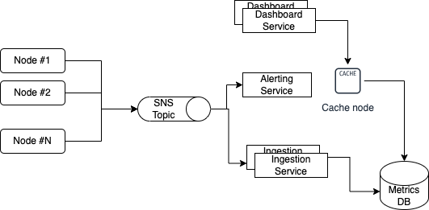

## Metrics aggregation service

### Requirements
 - Collect various metrics both basic and custom across different backend services
 - Collected data should be searchable 
 - Error Budget: data doesn't have to be perfect
 - The delay to see the most recent metrics should be ~1 minute
 - Metrics should be collected every minute or more often

### Design
We will use Agents for collecting basic metrics like CPU usage, Free memory, etc., and a library for applications    
to report application-specific custom metrics.
#### QPS, Throughput 
Let's assume that, on average, an application reports 200 different metrics. We currently have 3 applications. Each of them  
consists of a bunch of services, let's say 5. We will collect metrics every 5 seconds. That comes down to 200 * 3 * 5 / 5 = 600 requests/sec.  
Each request is approximately 300 bytes. That means we're looking at ~ 0.2 Mb/sec for our original configuration.

#### Data Storage
  Each data point will have the following shape: 
  ```
  metric      - name of the metric
  server_id   - the id of the server reporting the metric - unique per machine
  timestamp
  value       - the value of the metric, type is metric-dependent 
  labels      - an dynamic array of key-value pairs used to identify the data point (e.g. server_ip, service_group) 
  ```
Our application is write-heavy -> we need to ensure proper write throughput. We will be using a queue to hold requests  
until they're ready to be processed by the Ingestion Service(s). By default, AWS FIFO queues support up to 3,000 messages  
per second with batching. This should be enough for our use-case. 

For reads, the access pattern is: retrieve all values for a metric_id in a specified time range for a label (or set of labels)
To support this querying pattern, let's use a wide-column data store such as Cassandra. Let's use metric + timestamp + server_id as PK. value and labels will be our columns. 

Considering that we're expecting  0.2 Mb/sec of data, we will need ~17 GB to store a day worth of data. (6 Tb per year)
Theoretically, this could be achieved with a single HDD. Considering that we might want to compress historical data, we might need even less than that. However, we also want to do regular backups to make sure we don't lose historical data.

Since we prioritize latest data over historical data, we might want to cache a day-worth of metrics. That would require 17Gb of Cache.

### Architecture

#### Write
A Node Agent (or a library) collecting metrics puts a batch of metrics collected from the server on SNS. An Ingestion Service picks up a message and stores it in the DB. Optionally, an Alerting service picks up the message as well and, if needed, alerts on it.

#### Read
Dashboard UI requests metrics data for a time period for some service_group. If it's today's data, it should be in cache, and we can avoid a trip to the DB. Otherwise, fetch the data from the DB and return to the UI.


  

