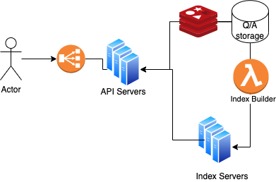

### Search Q&A

## Requirements
 - 95% of updates should be searchable within 10s after it's posted
 - 99% of search results should return < 1 s
 - should return top 100 results, ordered by "best match" 
 - 10 mln questions + 15 mln answers - it will double every year 
 - 200 mln search queries per month. Peak loads are 500 - 1000 search queries per second

## Non-requirements 
 - Autocomplete
 - Type ahead

## Design

 To achieve quick search, we need to maintain an index - a mapping between search terms and questions/answers  
 that contain those words.

### Index

 - Let's assume one word search terms
 - Let's assume that our words are in English and that there are 1 mln different words in English. 
 - Given that an average word length is 5 characters, we need 1 mln * 5 = 5 MB to store all words.
 - Our index will be a hash table with search terms as keys and objects of the following shape -     
   { questions: question_id_1, ... question_id_n, answers: answer_id_1 ... answer_id_n } -  as values
 - Given that an average page has 250 unique words, and we have 10 mln Q and 15 mln A that would give us   
   25 mln * 250 = 6,250 mln ids in the index. If each id is 8 bytes, that would be 50 GB.
 - We know that our data will double every year. We should keep in mind that our index will grow as well.  
   It's clear that we will need partitioning at some point. We can use consistent hashing.

### Architecture 
 - Given that we should be able to support 500 - 1000 search queries per second at peak loads, we need to be able  
   to autoscale our API servers based on the traffic.
 - We will store our indexes in memory, in a cluster of index servers with 16 GB RAM each. We will start with  
   6 servers for replication. 
 - Before returning the response, an API server merges data from the index servers and the data from the Q/A  
   storage. To cache the most popular search Q/A objects, let's put Redis Cache in front of the Storage
 - Every 7 sec or so, we will run Index Builder lambda to update the index on all index servers. 
 - We might want to do index snapshots from time to time to be able to recover in case of an outage

