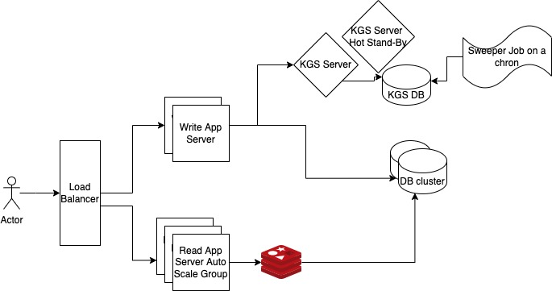

# URL Shortener
## Functional Requirements
    - A user should be able to generate a unique short link for their long link
    - A user should be redirected to the long link when clicking on the short link
## Technical Requirements
    - Minimal latency
    - High availability - absolutely critical

## Capacity Estimations and Constraints
    - Read-heavy system 

### Traffic Estimates
    - 10 mln new links per day
    - 100 clicks per links, most of the clicks will occur right after link creation

### Bandwidth Estimates 
    - A 'create' payload would consist of a long link, potentially a custom alias and maybe some other metadata.  
    Let's ballpark it as 500 bytes
    - 10 mln / 24 / 60 / 60 = write 115 QPS => 115 * 500 B => 57.5 KB/s
    - 115 * 100 = 11500 read QPS => 11500 * 500 B = 5.7 MB/s. An average server supports 256 QPS. Therefore, we need  
      at least 50 average servers   
    - Theoretically, one server could support this write traffic. But it would not provide the availability we're going
      for. We will put a Load Balancer in front of our Write Application Servers so that even if one goes down temporarily  
      we could still operate.

### Storage
    The primary use case for this system is: retrieve the long link given the short link. We also anticipate storing 
    billions of rows. Let's use a key-value store like Dynamo DB. 

    To store the 10 years worth of data, we would need 10 mln * 500 B * 365 * 10 * ~ 5 GB per day * 365 * 10 = 18.25 TB
    This will require us to use multiple machines. We can use Consistent Hashing for Partition/Replication.

## URL generation algorithm

    Let's find out how long our short links should be. Let's say we want to store our links for 10 years. Given that  
    every day we get 10 mln new links, that would give us 10 mln * 365 * 10 = 36.5 bln links. Let's say we only want
    to support Base64 encoded characters in our links. Given the lenght of 6 characters, we can generate $64^6$ = 
    ~68.7 bln links. Looks like 6 characters would suffice.

    Let's consider two options: 
### Pre-generate keys
    Have a service that generates unique 6-character strings beforehand and stores them in the DB. As an improvement, 
    Write App Server could keep some keys from the KGS DB in-memory ready for the allocation. When the key is allocated,
    we should mark it as 'used'. Tens of bilions of rows probably won't fit on one machine, so let's have a sweeper
    that runs overnight and removes 'used' rows.
        TODO: downsides of the approach? Seems pretty good 
### Hash URLs 
    Let's hash URLs. Since we want even the same URLs to generate unique short URLs, we need to randomize the output
    of the hash function. We could add user ID (if we have it) and/or timestamp. Let's use a hash function - maybe  
    MD5 - Base64-encode the output and take the first 6 characters of the result. Insert into the DB if this hash (key)  
    doesn't exist.
    **Cons:**
     - Collisions will make us trigger this function again and again until we get a unique string.
     - Higher latency than the previous approach

