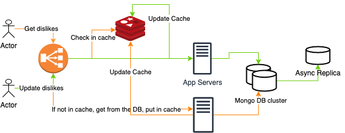

## Return YouTube Dislike
### Problem
YouTube removed dislike count from both their UI and API. We want a browser extension and a backend that allows us to bring back YouTube dislikes to the extent possible. Assume we have 1 mln users and historical data for 200 mln videos. We expect explosive growth. 

### Some Stats
- Number of videos watched per day is 5 billion  
- Overall, there are hundreds of millions of videos.
- The perfect ratio between likes and views is LIKES: VIEWS = 4%. In simpler terms, at least 4 like every 100 views. 
- The average Like/Dislike ratio is 90%; this means that for every 9 likes, there is 1 dislike. Considering we have 5 bln views per day, we expect to receive 5,000.000 dislikes per day.

### Design

#### Estimates
- Since every day 5 billion of videos is watched, RPS would be ~ 60,000. 
- Since every day we expect 5 million dislikes, WPS would be ~ 60.

#### API

Endpoints
 - get dislike count by video id - merge historical dislikes and dislikes we collected
 - update dislike count for a video in the DB

API Design Thoughts
- To support 60,000 RPS, we need ~ 30 servers. 
- The database might be the bottleneck here. We will need to cache popular videos counts. Let's cache 20% - 200.000.000 videos - ~ 4GB
- We will use SSO to authenticate a user (register our App with Google)
- We need to use API rate limiting to protect our servers from DDOS.

#### Storage
- Youtube `video_id` is an 11 character string (11 bytes). 
- The most disliked video has 20.25 million dislikes. We can use an int (4 bytes) to store a dislike counter

- Considering that we only need to store a mapping between video ids and dislike counts, we should use a simple key-value store.
- Since every object is 15 bytes, even if we round up to 20 bytes, considering there are hundreds of millions of videos overall, our total storage size is still quite small: 1 bil * 20 bytes = 20 GB. Technically, we can fit it on one disk.
- We don't want the DB to be the bottleneck, and uptime is more important than accuracy, so let's use async replication. Let's start with one replica

### Cost Estimates
- If we go with Mongo DB and choose M20 cluster with 20 GB storage, 4 GB, 2 vCPUs at $0.20/hr, that would yield ~$150 in costs. To support our replica, we need to double the costs.
- A 10 GB Redis cluster will cost us ~$340
- Now, the biggest expense will be the servers. t2.micro should be able to handle 2000 RPS. Its price is $9.50/month. We need 30 servers => $300/month.

Total will be  ~ $1,000/month

### Notes
- We don't need a full-blown server to serve dislike counts, maybe we can find a cheaper solution?
- To speed up reads, we won't do any locking when writing/reading to/from the DB
